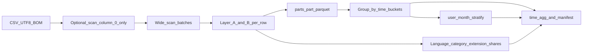

# Architecture

## Scope

This repository implements a **Docker-first batch analytics** stack for a single large CSV of diarized transcriptions. **Layer A** (structural / schema-faithful signals) and **Layer B v3** (Unicode/lexical stats, script ratios, **lingua** language ID, `file_name` metadata, plus **`content_category`** rule-based primary labels and confidence) are computed per row, then aggregated over **calendar day**, **ISO week**, and **calendar month** using `created_at`. When Layer B is enabled, optional outputs include **language share**, **content primary category share**, and **file extension share** per bucket, plus **per-user × month** numeric summaries.

Methodology and definitions of “quality” may evolve as the analysis framework matures; this document focuses on the currently implemented pipeline.

## High-level data flow

0. **`count_phase` (default on interactive full runs):** `ingest.count_csv_logical_rows_first_column` streams **only column index 0** (`id`) to tally logical CSV rows cheaply before ETA + **read_phase** (still quote-aware).

1. **Ingest (read_phase):** `transcriptions_analysis.ingest.read_csv_batches` uses full columns via `scan_csv` + `collect_batches` so **multiline quoted fields** stay valid (RFC 4180–style). UTF-8 BOM is handled by renaming affected column names (for example `\ufeffid` → `id`).
2. **Features:** Each row’s `transcription_text` is parsed once (`text_format.parse_segments`); **Layer A** (`metrics_layer_a`) and optional **Layer B** (`metrics_layer_b`, `content_*` helpers) add scalar columns. Layer B can be disabled with `--no-layer-b`.
3. **Persistence:** Each batch is written to `outputs/<run_id>/parts/part_XXXXX.parquet`.
4. **Aggregate:** Rows with parseable `created_at` are bucketed; **median**, **Q1**, **Q3**, and **n_rows** are computed per numeric metric column and written as Parquet + CSV. When Layer B is on, **categorical share** tables (language, **`content_primary_category`**, file extension) and **user × month** aggregates are written (unless opted out — see [Operations](operations.md)).
5. **Visual export (default on):** Reads aggregate Parquets back from disk and builds **tidy long CSVs**, **matplotlib** PNGs (median ± IQR + N) for day / ISO-week / month buckets, a **stacked daily language-mix** figure when Layer B ran, and **`report.html`** — one Russian page with **day-only** metric plots (week/month plots remain as files under `figures/`) — see `transcriptions_analysis.visual_report`.
6. **Provenance:** `manifest.json` and `metrics_dictionary.json` are written alongside aggregates (see [Operations](operations.md)).

## Python package layout (`src/transcriptions_analysis/`)

| Module | Responsibility |
|--------|----------------|
| `ingest` | Batched CSV reads, optional logical row count via column 0, BOM normalization, fingerprint for manifest |
| `text_format` | Diarized layout: separators, `SPEAKER_*`, bracketed timestamps |
| `metrics_layer_a` | Per-transcript Layer A features; `compute_layer_a_for_parsed` avoids double-parse with Layer B |
| `content_text` | Unicode oddities, script ratios, lexical stats on segment bodies |
| `content_category` | Rule-based **`content_primary_category`** + **`content_category_confidence`** from cleaned segment bodies + `ParsedSegment.speaker` structure (`CONTENT_CATEGORY_RULES_VERSION=v2_strength_primary`) |
| `content_language` | Singleton **lingua** `LanguageDetector` with ISO allow-list |
| `content_metadata` | `file_name` → extension, basename tokens, path depth |
| `metrics_layer_b` | Layer B + content columns; `NUMERIC_LAYER_B` for aggregates (includes `content_category_confidence`; category string is categorical, not in numeric union) |
| `aggregate` | `created_at` parsing (naive), bucket columns, `aggregate_bucket`, `aggregate_categorical_share`, `aggregate_user_month` |
| `artifacts` | `RunManifest`, `metrics_dictionary.json`, combined metric version string, lockfile hashing |
| `visual_report` | Long-format aggregate CSVs, matplotlib PNGs (median + IQR + N), stacked language share (daily for HTML), single RU `report.html` (day metric charts) |
| `cli` | `ta-batch` entrypoint (`run`, `staging-parquet`) |
| `logging_utils` | Key=value structured log lines for batch jobs |

## Final report builder

`scripts/build_final_research_report.py` builds `outputs/final_research_report.html` from an existing run under `outputs/<run_id>/`:

- Inputs: `manifest.json`, monthly category/language share CSVs, `metrics_dictionary.json`, and `figures/**/*.png`.
- CLI: `--run-id <uuid>`, optional `-o/--output`, or `FINAL_REPORT_RUN_ID` env var.
- Daily PNG assets are embedded as base64 data URIs to produce a portable HTML file.

**Declared but not yet used in batch code paths:** `duckdb` (dependency reserved for SQL-on-Parquet exploration).

## Docker images

- **`base` target:** batch image; non-root user `ta` (uid 1000); entrypoint runs `ta-batch` via `scripts/docker-entrypoint-analytics.sh`.
- **`notebook` target:** adds JupyterLab; Compose **profile** `notebook` exposes port 8888.

## Out of scope (current code)

- **Layer C** metrics, CI pipelines, and dedicated DuckDB SQL scripts are **not** implemented in the default batch path (static **matplotlib** summaries are generated by default when `--export-report` is on).
